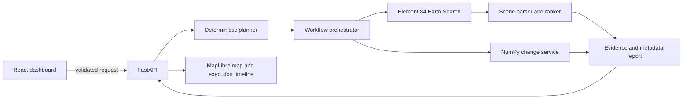

# Agentic Earth Intelligence

[](https://github.com/tushar2159/agentic-earth-intelligence/actions/workflows/ci.yml)
[](https://fastapi.tiangolo.com/)
[](https://earth-search.aws.element84.com/v1)

Natural-language planning and traceable Earth-observation analysis built around the public Element 84 Earth Search STAC API. The application combines explicit workflow state, deterministic spatial services, a FastAPI boundary, and a React/MapLibre dashboard.

**[Open the live dashboard](https://tushar2159.github.io/agentic-earth-intelligence/)** · The hosted showcase automatically performs a real Earth Search query, displays returned scene footprints over an XYZ satellite basemap, and supports rerunning the prompt. Run the containers for the complete FastAPI workflow.

> **Implemented scope:** request planning, live STAC search, scene parsing/ranking, execution traces, metadata reporting, array-based change statistics, interactive map UI, containers, tests, and CI. Pixel-level COG compositing and LLM-provider integration are documented extensions—not implied existing behavior.

## Why this project

GeoAI demonstrations often stop at a model notebook. Agentic Earth Intelligence shows the application boundary around analysis: translate intent into a plan, validate spatial input, discover public imagery, preserve evidence, run deterministic computation, and expose results through an API and product interface.

## Architecture



## Key capabilities

- Parses change, discovery, and time-series intent from natural-language requests
- Extracts temporal ranges and location phrases into a typed analysis plan
- Executes real POST searches against Element 84 Earth Search v1
- Supports `sentinel-2-l2a` and `landsat-c2-l2` through configuration
- Filters by bounding box, date range, collection, and cloud cover
- Preserves scene footprints and public asset links as structured evidence
- Ranks scenes deterministically and records every workflow transition
- Computes thresholded array-change statistics with component filtering
- Provides FastAPI health, readiness, catalog-analysis, and change endpoints
- Presents an interactive React + MapLibre dashboard
- Builds backend and frontend containers through Docker Compose

## Repository structure

```text
.
├── config/default.yaml
├── src/agentic_earth/
│   ├── analysis.py
│   ├── api.py
│   ├── cli.py
│   ├── models.py
│   ├── planner.py
│   ├── stac.py
│   └── workflow.py
├── tests/
├── frontend/
│   ├── src/
│   ├── Dockerfile
│   └── package.json
├── .github/workflows/ci.yml
├── Dockerfile
├── docker-compose.yml
└── pyproject.toml
```

## Earth Search workflow

1. Validate prompt, EPSG:4326 bounding box, collection, and cloud threshold.
2. Convert language into an `AnalysisPlan`.
3. POST the spatial and temporal filters to `https://earth-search.aws.element84.com/v1/search`.
4. Parse STAC Features into typed scene summaries.
5. Rank candidates by cloud cover and acquisition time.
6. Return the plan, trace, evidence, and a scope-accurate metadata report.

## Quick start

### API

```bash
python -m venv .venv
source .venv/bin/activate
python -m pip install -e .[dev]
uvicorn agentic_earth.api:app --reload
```

Open `http://localhost:8000/docs`.

### Dashboard

```bash
cd frontend
npm install
npm run dev
```

Open `http://localhost:5173`.

### Containers

```bash
docker compose up --build
```

The API runs on port `8000`; the dashboard runs on port `8080`.

## API example

```bash
curl -X POST http://localhost:8000/v1/analyze \
  -H 'Content-Type: application/json' \
  -d '{
    "prompt": "Analyze urban expansion around Pune from 2020 to 2026",
    "bbox": [73.7, 18.4, 74.0, 18.7],
    "collections": ["sentinel-2-l2a"],
    "max_cloud_cover": 20
  }'
```

This endpoint makes a live public catalog request. It does not claim to download and composite every returned raster.

## Testing

The offline suite injects catalog results, so CI does not depend on external service availability.

```bash
ruff check src tests
pytest --cov=agentic_earth --cov-report=term-missing
```

CI tests the backend, enforces coverage, builds the React application, and builds both containers.

## Engineering principles

- Typed API and workflow contracts
- Deterministic services around agent planning
- Injectable external-service boundaries
- Traceable control flow and evidence
- Offline tests for network-dependent behavior
- Explicit implemented-versus-future scope
- Non-root container runtime
- Dependency and CI automation

## Production extensions

Future work can add geocoding, signed COG reads, cloud masks, temporal mosaics, raster alignment, learned change models, durable job queues, object storage, OpenTelemetry, authentication, and an optional LLM planner constrained to the existing typed plan schema.

## Public data

Earth Search provides open STAC metadata and cloud-native dataset links. Users remain responsible for the terms associated with selected source collections.

## License

MIT.
